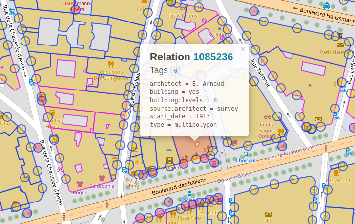

# Angular Google 3D Street View
This is an example repository for the use of 3D Google Maps with dynamic markers. In this example there will be an initial zoom on Paris using [tween.js](https://github.com/tweenjs/tween.js/) after which the markers will display. They're all clickable and will zoom using the Google maps camera. A polygon of the building will then be display, and the not-selected markers will be disabled. Due to missing polygons there isn't always the correct polygon.


## Installation
After cloning this repo you will need to update the environmental variables in `apps/front/src/environments`.

```ts
export const environment = {
  googleMapsApi: 'your-api-here'
};

```

Then run it with
```
nx run front:serve
nx run api:serve
```

## How to get coordinates
The method I've detailed here is obviously not a scalable solution but for demo purposes it suffices.

1. Go to https://osmbuildings.org/
2. CLick the `DATA` link top right
3. Click the `FREE DOWNLOAD` button. This will take you to https://overpass-turbo.eu/ with the correct query ready.
4. Find the address you want to visit, then click the `Run` button top left.
5. This will create a data grid on top of the map. Select the building the want and copy the relationId. Not every building seems to have this sadly.



6. Export the Data as GeoJSON
7. Find the Coordinates in the GeoJSON data using the relationId

## Further information
* [Google Maps API](https://developers.google.com/maps/documentation/javascript)
* [API for three.js](https://threejs.org/)
* [Tween.js animation library](https://github.com/tweenjs/tween.js/)

## Next Steps

1. Find a dynamic API for building coordinates
   - Try this: https://wiki.openstreetmap.org/wiki/Overpass_API
2. Move mock data to API
3. Move generation of markers to backend using [CSS painting API](https://developer.mozilla.org/en-US/docs/Web/API/CSS_Painting_API)
4. Zoomout/deselect button
5. Rotate camera around selected building
6. Improve camera handling on zoom in
